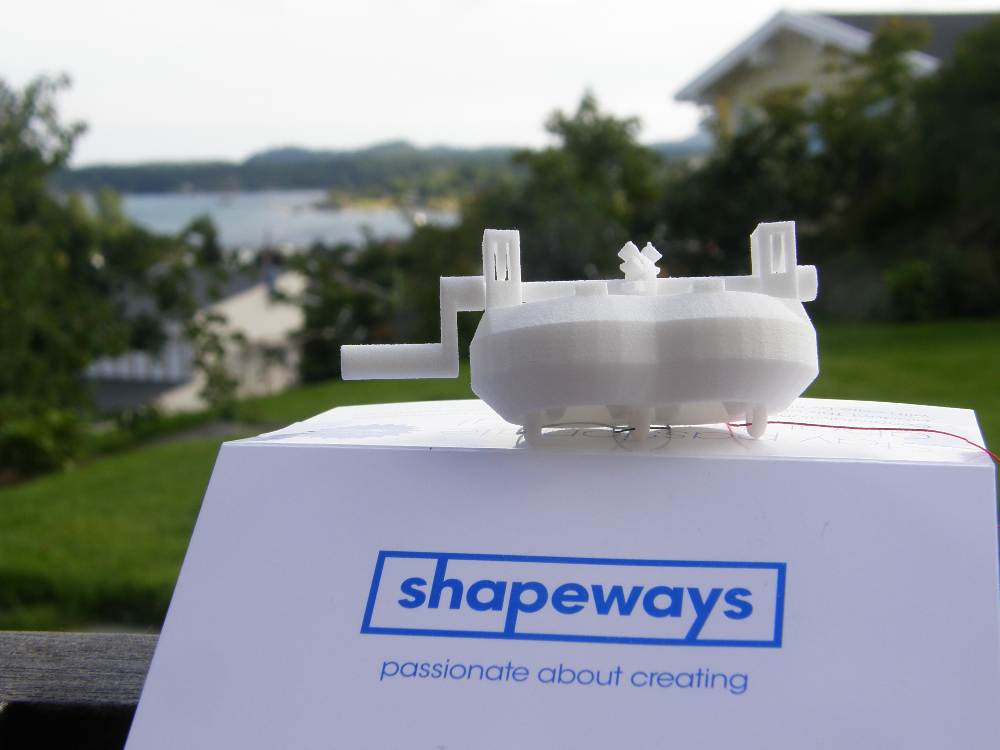
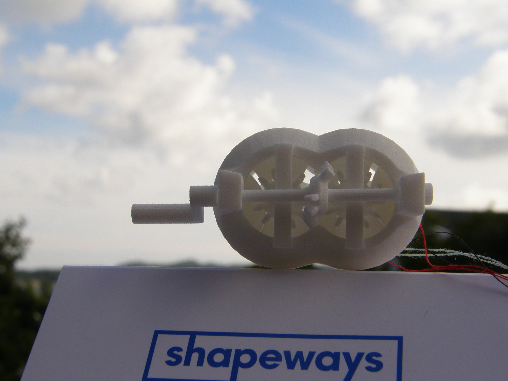
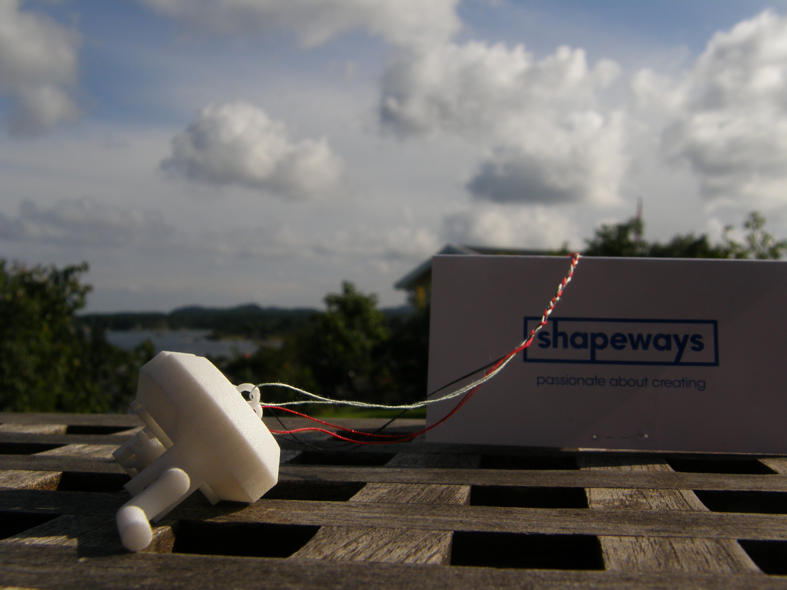

<iframe width="480" height="270" src="//www.youtube.com/embed/a1-L7Kb82iQ" frameborder="0" allowfullscreen></iframe>

In my spare time this summer I've been working on a mechanical braiding machine. I'm not sure where the idea came from, but one night I jotted down the design for a mechanism to braid three threads together. The design quickly went from the notepad by my bed to [Blender](http://www.blender.org/), where it took about 2 weeks of programming (the gears were generated by a python script) and modeling to have a finished braiding machine. Then it took [Shapeways](http://www.shapeways.com/) exactly one week to print up the device and deliver it to my door.

When I received it, a few parts were merged together, probably because of low clearance. Both the gears were merged with their respective axles, but a careful twist got them loose. The only other assembly required was to push the top axle with the gears into position (it was left out of position so the gears wouldn't merge together).

The BraidMaker worked as intended right away, except for locking up once in a while. This is solved by gently tapping the device so the pieces fall into the right spot (I have to do this a few times in the video). It runs smoother the more you use it though, probably a combination of me learning how to operate it properly and the track getting smoothed by the moving parts.

Some of the parts of the device are very thin, like the gear teeth (which are no more than a millimeter thick) but it is still very tough and handles being used very well. The material is truly white, strong and flexible. When running it leaves a thin blanket of white dust on the ground, probably from the moving parts grinding against each other, but that is (hopefully) only while it is new.

All in all I'm very satisfied with the BraidMaker. I was expecting several parts to be merged together, the gear teeth to be too thin and therefore snap when I'd try to use it, and the device failing to braid at all. Nothing has broken off yet, and it is quite capable of braiding (thin) threads!

The BraidMaker is available at my [Shapeways shop](http://www.shapeways.com/shops/gundersen) for $17 in WSF.
