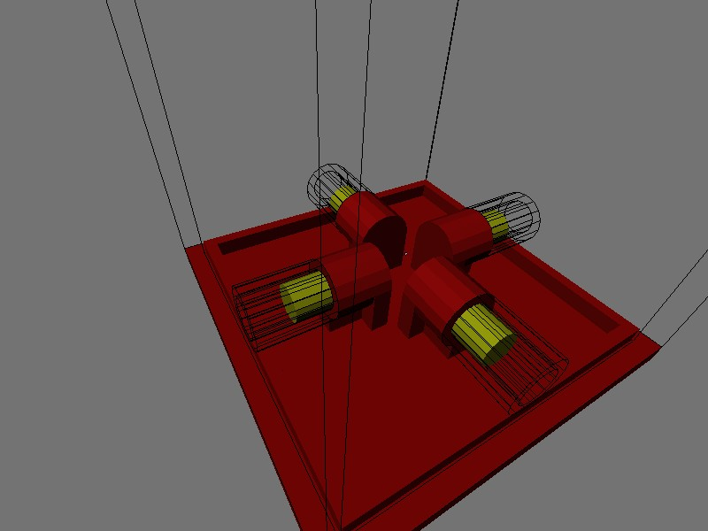
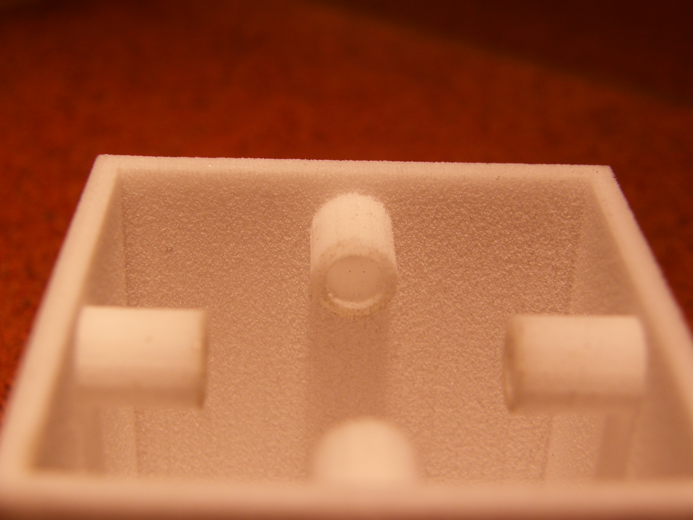
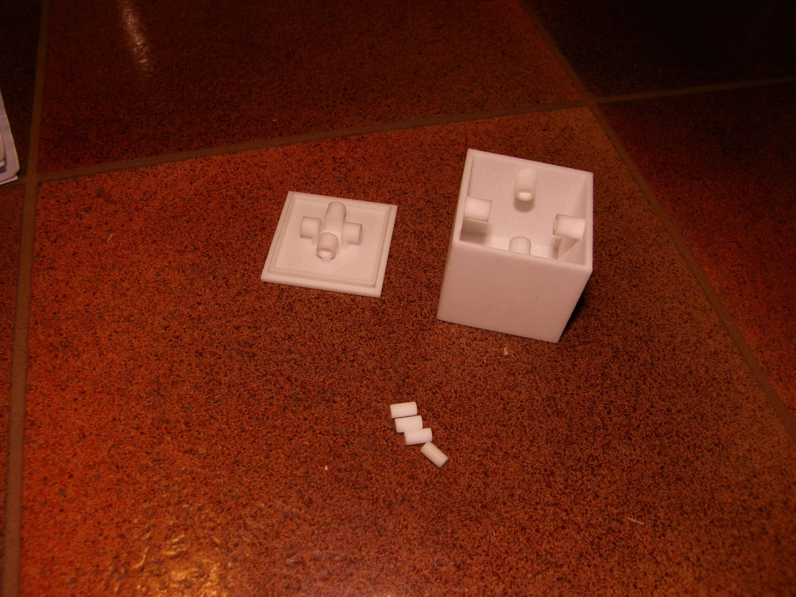

<iframe width="480" height="270" src="//www.youtube.com/embed/mzUjd7IYpXU" frameborder="0" allowfullscreen></iframe>

I just received my first ever 3D printed object from [Shapeways](http://www.shapeways.com/), a [CentripetalBox](http://www.shapeways.com/model/69177/centripetalbox.html). Shapeways provide a cheap and simple way to 3D print anything you can imagine in a variety of materials, including ABS (like Lego), stainless steel and even color printed 3D objects. This is the first time I have 3D printed anything, so I was quite excited, but at the same time expecting a designflaw showing up in the finished product.

The design I got printed was a CentripetalBox, a cube which needs to be spun around quickly to be opened. You can see a video of how it works below. The original design had 4 plugs which would fit inside the 4 slots in the box and lid, but due to the inaccuracy of the printing process, the plugs where slightly too big. The lid was also a bit too big, and needed to be sanded down slightly to fit inside the box. This was expected, but what was not expected was how tough the material was. I printed in [White, Strong and Flexible](http://www.shapeways.com/materials/white_strong_flexible), and while the surface is quite rough and seems fragile (small particles of the raw material powder will come loose if you scratch it), the actual box is pretty solid. I tried sanding down the plugs so they would fit inside the slots, but quickly moved to a file instead. A Dremel might have been a good tool to have handy. Instead of using the printed plastic plugs I used a thin steel rod cut into plugs. It might even be that the plastic plugs are too light to work. A few more days of sanding/filing, and I'll know.

Having discussed the end result and design with my dad, we came up with some improvements. I'll make a new version for the [Shapeways shop](http://www.shapeways.com/shops/gundersen) with those improvements (and bug fixes, like smaller plugs, and a tiny gap between the lid and the box). This is the first thing I have ever made in Blender and then 3D printed, and the fact that it works (with a bit of post-production work) is more than I expected. I have a few other ideas for 3D printing, and I'll work on them this spring (or autumn, if you are in Australia).

