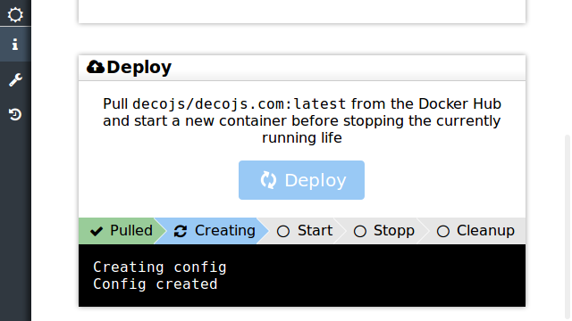
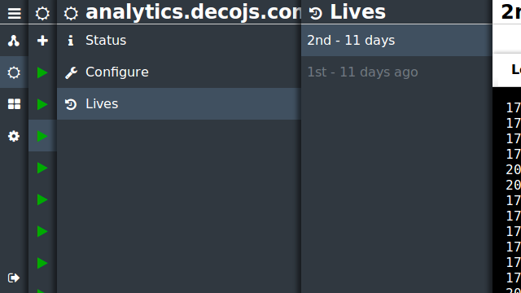

> Saṃsāra is a Sanskrit word, the literal meaning of which is "a wandering through" – in reference to the passage through many states of existence that is involved in the endless cycle of death and rebirth

About a year ago I started using docker for this website and all the related projects that I host here. In the beginning I would ssh into the linux box and run the cli commands for creating images and containers and running them, but this quickly got tiresome. The greatest feature with Docker is being able to deploy a brand new version of your application instead of having to tweak the existing deployed version. This means that you don't end up with an application installed on a server that nobody knows how to deploy other places. With Docker, if your container runs on one machine it will run on any other machine with Docker. The result is a new deployment every time you update the application code.

The problem I found with Docker is in specifying the runtime configuration of the containers. Having to remember all these configurations everytime I ran `docker run` became a real problem. I experimented with bash files for a bit, but realized I needed a better tool. Thats how the [Samsara](https://github.com/mariusGundersen/samsara) project started.

## The spirit of a container lives on

Lets say you have a project deployed as a Docker container. The project is under development, and a new version of the code is ready to be deployed. Since it's dockerized all you have to do is deploy the new version in a new container and stop the previous container. While we humans would look at this as upgrading the deployed version, Docker doesn't see it this way. Docker doesn't realize there is any relation between the old container and the new one; they are just containers.

This is what I wanted to do something about with Samsara. In Samsara the spirit of the container lives on and is reincarnated into a new container. The container is just the body of the application, and the soul of the application lives on when the container dies. In Samsara the spirit lives through several lives, and a deployment is the death and reincarnation of a spirit.

## Versions, tags and lives

So you have a new version of your application. The common way to keep track of an application is with version numbers. In recent years the [SemVer](http://semver.org/) has become the normal way to version applications. When you build a new version of your application you will increase (one of the major, minor or patch of) the version number.

Then it's time to create the Docker image to be deployed. The default docker tag `latest` is used to represent the latest version of an image, but you can create custom tags too. There isn't really a standard way to do this yet, but you can follow SemVer here too, and reflect the application version number. The important part to remember is that you can create a new Docker image more often than you create a new application version (for example because of changes to the Dockerfile or to upgrade the `FROM` image), so the tag and version number isn't one-to-one.

Finally there is the deployment. Initially I thought of using the application version number to represent a deployment, but quickly realize this won't work very well. As noted already, there are lots of runtime options for running a container, and so you are likely to create several deployments (while tweaking the runtime options) per version. Samsara therefore keep tracks of the lives of your spirit. Each time you deploy a new container it creates a new life, and gives the container a life number. This way you can map a life to a tag, and a tag to an application version number.

## Automated builds and webhooks

The usecase I initially wanted to cover was using the automated builds and webhooks from [Docker Hub](https://hub.docker.com/) to automate deployments. Most of the applications I make are tracked on GitHub, and I wanted to set up automated deployment of these applications. So when I push changes to my master branch on GitHub, a new build is triggered on the Docker Hub. The new container is automatically built and when it is ready Docker Hub will notify a REST endpoint.

Samsara therefore comes with a REST endpoint that, when called with the right parameters, will automatically pull the new image, create a container and run it.

## Mobile first

Samsara is not only usable on a mobile phone, it's mobile first. It is great being able to deploy a new application from my mobile phone on the bus to work over a 3G network. Maintaining applications should be simple enough to be done on a mobile phone.

## Work in progress

I made Samsara because I needed it, and so I'm using it to maintain my production website. It works well enough for me, but is still a bit rough around the edges. I am continuing to develop Samsara by fixing issues and adding new features. The goal is to have a small and simple tool to maintain personal websites, not to create a competitor to Kubernetes. Samsara therefore must be simple to set up (It's currently a single docker run command) and use for everyone.

The source code is available on [Github](https://github.com/mariusGundersen/Samsara) and it's automatically built on the Docker Hub as [`mariusgundersen/samsara`](https://hub.docker.com/r/mariusgundersen/samsara/).
