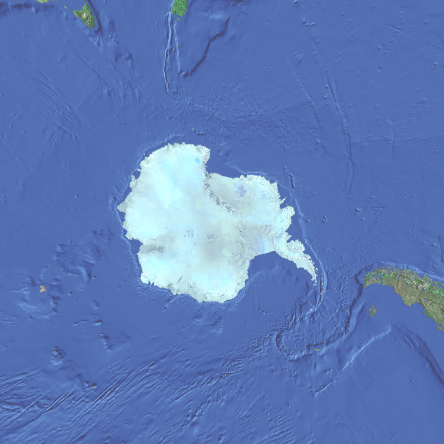
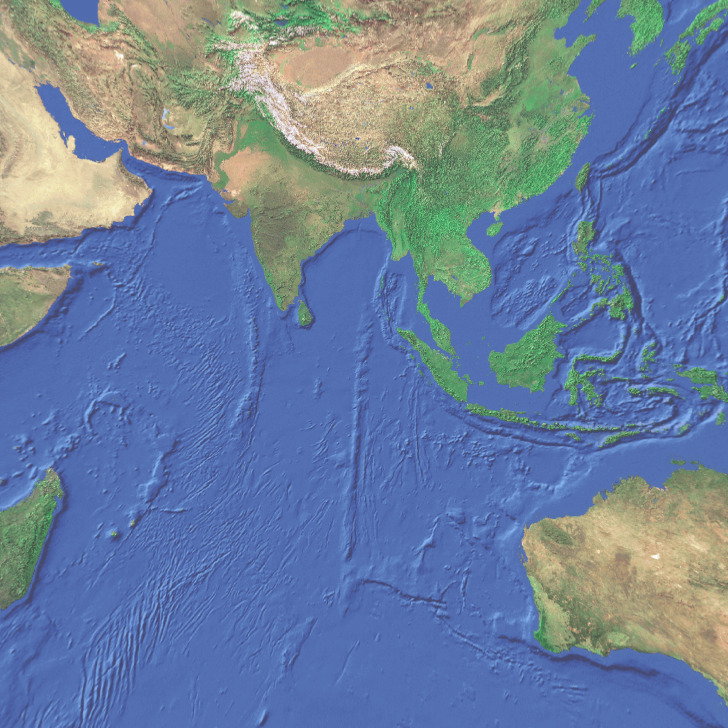
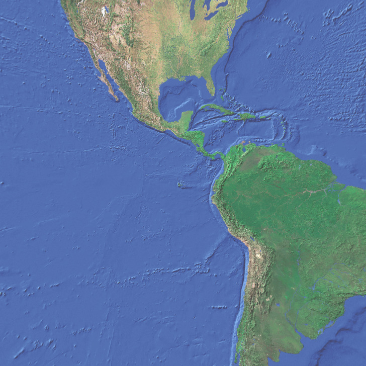
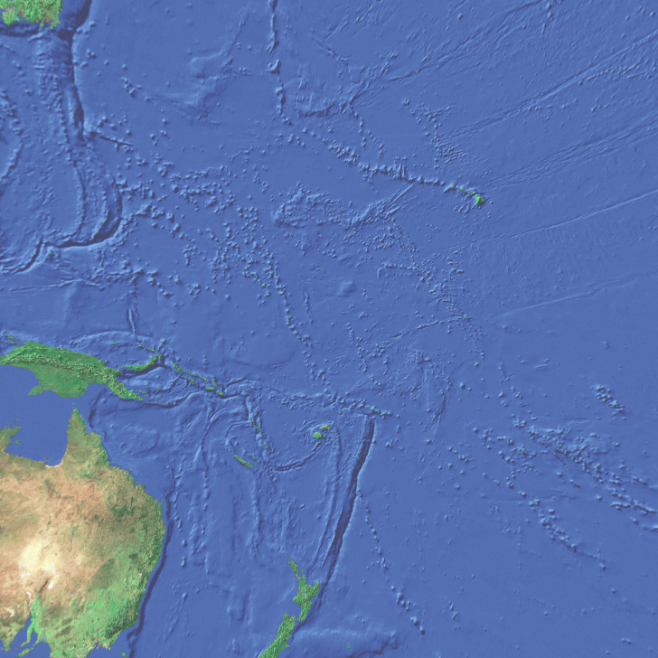
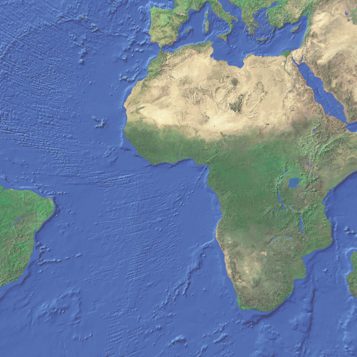

I just saw a [small neat demo of a rotating earth cube using css and js](https://www.thomasweibel.ch/earthcube/), and thought to myself "I can do that in only css". So that is what I'll do here. 

This article is the written log of how I have done this, so it might be a bit weird and rambly. Here goes.

The first step is to get the 6 images and create an earth div with the six images. Note: The blog I'm writing this wraps `` in `<picture>`, so I had to make it work with that. I couldn't be bothered to figure out how to disable the wrapping for this code only.

```html
<div class="earth">
  <picture></picture>
  <picture></picture>
  <picture></picture>
  <picture></picture>
  <picture></picture>
  <picture></picture>
</div>
```

<div class="earth">
  
  
  
  
  
  
</div>

The six images now need to be positioned into a cube. This can be done using the 3d css transform. For that to work we need to put the earth into a div that has some perspective applied, using the `perspective: 1000px` css rule.


<div class="space">
  <div class="earth">
    
    
    
    
    
    
  </div>
</div>

This was done with roughly this css: 

```css

.space {
  perspective: 1000px;
  display: grid;
  place-content: center;
  height: 400px;
  background: rgb(1, 5, 25);

  .earth {
    display: grid;
    transform-style: preserve-3d;
    width: 200px;
    height: 200px;
    animation: rotate 20s linear forwards infinite;

    picture {
      grid-area: 1 /1;
      transform-style: preserve-3d;
      
      img {
        position: absolute;
        top: 0;
        left: 0;
        width: 200px;
      }
    }

    [alt="top"]{
      transform: translateY(100px) rotateX(-90deg);
    }
    [alt="bottom"]{
      transform: translateY(-100px) rotateX(90deg);
    }
    [alt="left"]{
      transform: translateX(-100px) rotateY(-90deg);
    }
    [alt="right"]{
      transform: translateX(100px) rotateY(90deg);
    }
    [alt="front"]{
      transform: translateZ(100px) rotateX(0deg);
    }
    [alt="back"]{
      transform: translateZ(-100px) rotateY(180deg);
    }
  }
}

@keyframes rotate {
  from {
    transform: rotateY(0turn) rotateX(0turn);
  }
  to {
    transform: rotateY(4turn) rotateX(1turn);
  }
}
```

This css makes a cube and makes the cube rotate slowly around two axis. It's now a rotating cube, but it does not have any light effects added to it.

## Lighting

My plan is to use some basic lighting effects for this demo, and therefore I looked into the [Phong reflection model](https://en.wikipedia.org/wiki/Phong_reflection_model). This controls how much light a material reflects from the ambient surrounding and from the direct light. This can be simulated in css using the [`brightness()`](https://developer.mozilla.org/en-US/docs/Web/CSS/Reference/Values/filter-function/brightness) filter, which takes a value from 0 to 1, and beyond.

<div class="brightness-demo">
  
</div>

We could set this to a constant value for the six sides, and it would look like a cube with a directional light on it, but it would be pretty static. Look at this demo and see that each side has a different brightness, but the brightness doesn't change.

<div class="space static-light">
  <div class="earth">
    
    
    
    
    
    
  </div>
</div>

To solve this we need to imagine there is a strong light source somewhere in space, like a sun. We then need to see if each face points towards or away from the light source. The wikipedia page explains in more detail, but the simple solution is to take the dot product between the normal of the face and the direction to the light and to multiply this by some constants for the light source and the material. The brightness can be simplified to the sum of three components:

```css
--brightness: calc(var(--ambient-light, 0) + var(--diffuse-light, 0) + var(--specular-light, 0));
```

In the code above I set it so that if they aren't defined they don't contribute. This way we can add them as we go. The first step is to add some ambient light. That is just a constant value

```css
--ambient-light: 0.3;
```

<div class="space phong-light">
  <div class="earth">
    
    
    
    
    
    
  </div>
</div>

That's very dark, but then we don't have a sun yet. Let's add a sun that is positioned to the right in space (like that makes sense). That way we can assume that the vector from the center of the earth-cube to the sun is `1, 0, 0`. 

<link rel="stylesheet" href="./style.css">