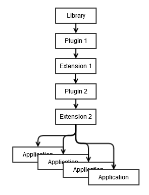

# Dependency Chain

Dependency chaining is a simple way to extend the functionality of a library using modules. The chain consists of a root module, containing the library to be extended, and several links, each of which extends the previous link in the chain with new functionality. Application modules which depends on the library are given the last link in the chain; the library with all the extensions applied to it.



The result is that all the extensions and plugins are applied before any of the application modules are given the library. With a chain the developer has full control over the order the plugins are applied in. Neither the root library nor the application modules need to know that a dependency chain is used.

## Dependency chains in AMD
**[Demo of Vector dependency chain](http://lab.mariusgundersen.net/dependency-chain/Vector/)**

A dependency chain consists of a root library, for example this simple `Vector` module:


```JavaScript
//Vector.js
define(function(){

  //A simple vector class, with two properties
  function Vector(x, y){
    this.x = x;
    this.y = y;
  };

  //This module exposes the Vector constructor
  return Vector;
});
```

It does not currently do very much, but we can write two extensions to it, one for adding two vectors together and another for reversing a vector:

```JavaScript
//Vector.plugin.add.js
define(['Vector'], function(Vector){

  //add a new method to the Vector
  Vector.prototype.add = function(that){
    return new Vector(this.x + that.x, this.y + that.y);
  };

  //return the Vector
  return Vector;
});
```
```JavaScript
//Vector.plugin.reverse.js
define(['Vector'], function(Vector){

  //add a new method to the Vector
  Vector.prototype.reverse = function(){
    return new Vector(-this.x, -this.y);
  };

  //return the Vector
  return Vector;
});
```

Instead of having our application code depend on one of these plugins, we can set up the dependency chain in the require config:

```JavaScript
//main.js
require.config({
  chain: {
    //name  : [root, first link, second link, ...]
    'Vector': [
      'path/to/Vector',
      'path/to/Vector.plugin.add',
      'path/to/Vector.plugin.reverse'
    ]
  }
});
```

This config file sets up a chain with the name of the root library (`Vector`), and a list of modules to chain together. The first entry in the list is the path to the root library (`Vector.js`). The rest of the array is the links in the chain. Each entry in the array is given the previous entry, rather than the root library. The `Vector.plugin.reverse` module is given the result of the `Vector.plugin.add` module instead of the `Vector` module.

An application module which wants to use the `Vector` module, with all of the extensions applied, uses the name of the chain, and is given the last entry in the chain:

```JavaScript
//MyApplication.js
define(['Vector'], function(Vector){

  var v1 = new Vector(3,2);
  var v2 = new Vector(1,5);

  //Vector has been extended with the add and reverse methods
  console.log(v1.add(v2.reverse());

});
```

**[Demo of Vector dependency chain](http://lab.mariusgundersen.net/dependency-chain/Vector/)**

## Extending existing libraries using dependency chaining

The only requirement for dependency chains is a `chain` in the config file and extension modules which return the original module they depend on. Neither the root library nor the application modules need to know that a dependency chain has been used. This means that existing AMD libraries can be used in dependency chains without any modifications. jQuery, for example, is very easy to extend with new functionality through the `jQuery.fn` object. Each jQuery plugin can be placed in a separate module, and chained together:

**[Demo of jQuery dependency chain](http://lab.mariusgundersen.net/dependency-chain/jQuery/)**

```JavaScript
//jQuery.plugin.math.js
define(['jQuery'], function($){

  //add a new method to jQuery
  $.fn.add = function(a, b){
    return a + b;
  };

  //return jQuery
  return $;
});
```

Knockout is another example of a library which can be extended. Knockout supports extensions and custom-bindings, all of which can be placed in separate modules and chained together.
[Demo of Knockout dependency chain](http://lab.mariusgundersen.net/dependency-chain/knockout/)

## Mocking using dependency chaining
Dependency chaining can be used to mock out parts of a library during testing. For example, during testing ajax calls should not be run, but instead be mocked to return the expected result. The mocked ajax method can also be observed to see if it is called with the correct parameters. [Demo of mocking using dependency chaining](http://lab.mariusgundersen.net/dependency-chain/mocking/)

## Dependency chaining today
AMD does not yet support dependency chaining, but it can be added with a [small extension](https://github.com/mariusGundersen/dependency-chain/blob/master/require.plugin.chain.js) to require.js.

