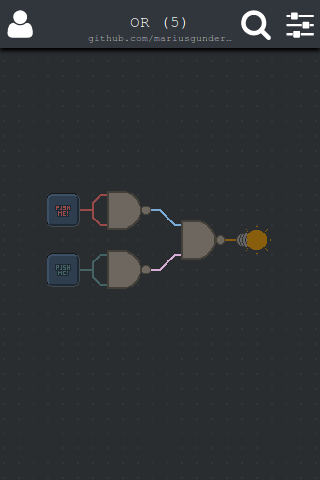
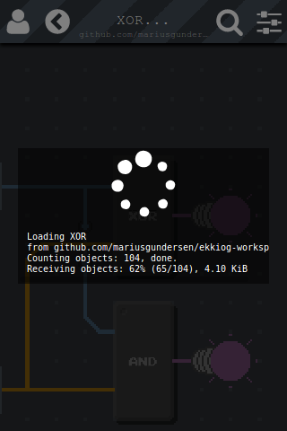

# Ekkiog followup

Almost two years ago I [wrote about Ekkiog](https://mariusgundersen.net/ekkiog/), and since then I haven't really written anything here, about it or anything else. In coding I follow the philosophy of agile/scrum/xp/mvp/ci where a program should always be usable and useful, but also under continuous development and improvement. And so I have worked on Ekkiog for almost two years, adding new features, improving existing parts and refactoring code, but always trying to have a working product. But with writing, I never feel ready to post about it, as the article is never good enough, never really done. And so I've started writing about what I've done multiple times, but never completed it. It's weird how I'm comfortable publishing code that is usable but not done, but not comfortable publishing an article as it never feels finished.

### What is Ekkiog?

Ekkiog, the name, is a combination of two Icelandic (or old norse) words; *ekki* (not) and *og* (and), which describes the [NAND gate](https://en.wikipedia.org/wiki/NAND_gate) that is at the core of the mobile webapp ([Ekkiog](https://ekkiog.mariusgundersen.net) is made for mobile devices, and therefore only works on touch screens). A NAND gate is a simple [logic gate](https://en.wikipedia.org/wiki/Logic_gate), with two inputs and a single output, and the output is logic high (aka true, 1) unless both inputs are high, in which case the output is low (aka false, 0). This is one of the simplest logic gates, but it has a special property in that it can be used to make all other logic gates. A single [NAND gate](https://ekkiog.mariusgundersen.net/c/NAND/github.com/mariusGundersen/ekkiog-workspace) can be used to make a [NOT gate](https://ekkiog.mariusgundersen.net/c/NOT/github.com/mariusGundersen/ekkiog-workspace), two NAND gates can be used to make an [AND gate](https://ekkiog.mariusgundersen.net/c/AND/github.com/mariusGundersen/ekkiog-workspace), three NAND gates can be used to make an [OR gate](https://ekkiog.mariusgundersen.net/c/OR/github.com/mariusGundersen/ekkiog-workspace) and four NAND gates can be used to make an [XOR gate](https://ekkiog.mariusgundersen.net/c/XOR/github.com/mariusGundersen/ekkiog-workspace). This is called NAND logic, and using enough NAND gates you can make a computer.

For example, combine an AND gate and an XOR gate, and you have a [half-adder](https://ekkiog.mariusgundersen.net/c/HALF-ADDER/github.com/mariusgundersen/ekkiog-workspace). Combine two half-adders and an OR gate, and you have a [full-adder](https://ekkiog.mariusgundersen.net/c/HALF-ADDER/github.com/mariusgundersen/ekkiog-workspace). Four full-adders combined will give you [a circuit that can add two four bit numbers together](https://ekkiog.mariusgundersen.net/c/ADD-DEMO/github.com/mariusgundersen/ekkiog-workspace).

<iframe width="320" height="568" src="//www.youtube.com/embed/ROARDHocWkQ" frameborder="0" allowfullscreen></iframe>

The components I have linked to above are interactive; try tapping a button (labeled "PUSH ME!") and you'll see the wires and (ugly) bulbs light up. You can double tap the components to open them up and see how they work, recursively going deeper, from the large and complex components into increasingly simple components, and then go back out of them using the back button that shows up in the upper left corner. These examples are in read-only mode, in that you can play with them and see how they work, but you can't edit them. Ekkiog is primarily about making, so of course you can make your own components. For example, click [here](https://ekkiog.mariusgundersen.net/c/NOR) to make a [NOR gate](https://en.wikipedia.org/wiki/NAND_logic#NOR).

### Sharing components

About a year ago, after I got the editing and the components to work well enough, I started working on a way to share components that I had made. But I didn't want the components to be files that had to be sent around, I instead wanted links that were short and friendly that could open the components. This meant storing the actual data somewhere, and retrieving it when linked to. Instead of making a backend with a database, I decided to use git and GitHub/BitBucket/GitLab/etc as the storage mechanism. This way editing while offline would not be a problem, as the changes could be synced later, and I had a way to store the entire edit history, with undo/redo, of a component.

So to share your component with others you need to synchronize (git push) it to an [online git repo](https://github.com/mariusgundersen/ekkiog-workspace/tree/HALF-ADDER). I've only implemented GitHub for now, so if you have a GitHub account then you can log in by clicking the person icon in the upper left corner. After logging in you can synchronize with the GitHub repo and then you will have a branch for each component you have made. Click on the sliders icon in the top right corner to reveal (among some other buttons) the paper airplane icon, which will give you a shareable link. When others follow this link they will do a shallow clone of the git repo to download the component (branch) that you have made.

### What's next?

Back in 2016 I wrote that I had three ideas, or goals, for Ekkiog: to make some kind of programming game to use while away from a PC, to make something big from something small, and to make a logic circuit sandbox game. At the time I only had a very simple simulator and editor, but I had a rough idea of what I wanted, and I've worked on it in my free time since then. I've used Ekkiog as a way to not only implement something I want, but also to learn and teach myself new things. I have learned how to use [React](https://reactjs.org/) and [Redux](https://redux.js.org/) (and when not to use them), [RxJs](http://reactivex.io/rxjs/) and [WebGL](https://developer.mozilla.org/en-US/docs/Web/API/WebGL_API), and I've learned how to use tools like [Webpack](http://webpack.github.io/) and [TypeScript](https://www.typescriptlang.org/). I've also taken some detours to implement other things I've needed (or wanted), like [ReaxJS](https://www.npmjs.com/package/reaxjs), [w3c-manifest-loader](https://www.npmjs.com/package/w3c-manifest-loader) and for the past year or so, [ES-git](https://github.com/es-git/es-git).

Ekkiog is fairly usable, but far from done. It can really need some polish to remove some small annoying bugs, to make it more robust and user friendly. I'm working on some small features, like labeling buttons, lights and component inputs and outputs, and I want to redraw the tiles and icons. Next I want to add a 7-segment display, to make the output of components easier to read, and I want to make some small improvements to the editor. But the big milestone that is left to do is to make it into a game. That is, have a challenge or puzzle to solve and then a way for the game to verify that the component you have made completes the challenge and solves the puzzle.

In addition I want to share what I have learned while making Ekkiog, and so I hope to write a few articles about how it works. For example, I want to write about how I'm using WebGL not for 3D graphics, but for simulating logic gates and as a tile engine and text renderer. I'd like to write about the persistent data structures and how using immutable data and diffing gives huge advantages and works well with redux, WebGL textures and git. I want to write about how git works and how it can be implemented in JavaScript and made to work in the browser. And I have an idea for how to implement the puzzle solution verification code, and I'll try to write about it while I'm implementing it.

But most of all I have to get comfortable with publishing what I've written, even if it doesn't feel perfect. So I apologize for clumsy writing and rough drafts; I hope to improve my writing by sharing what I'm coding.