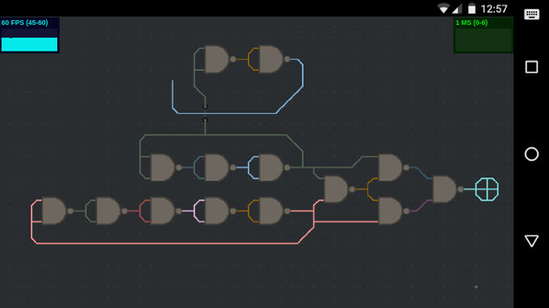
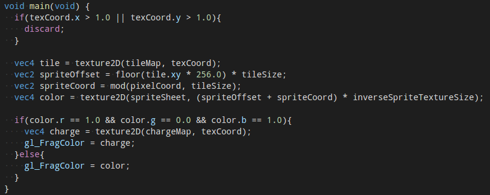

# Ekkiog: Turing Complete NAND-Simulator

Today is the end of my summer holiday, and so I've decided to publish the status of my 2016 summer hobby project. This year I've been working on a webapp called Ekkiog, which is a NAND gate simulator for smartphones, using WebGL to concurrently simulate 65536 gates at 60 fps. If you are on a smartphone, click the link below to test it out. You can find the source code at [GitHub](https://github.com/mariusGundersen/ekkiog).

### [Click here for demo](https://ekkiog.mariusgundersen.net)

Ekkiog is based on three ideas I've had for some time, and at this state it contains two of them. I'll get back to the third one at the end of the article.

The first idea is to produce for entertainment while on the go. For a long time I've wanted a way to program while on the move, away from a propper PC, just for fun. Most games are destructive, but I more enjoy constructing things, so for entertainment on a long flight, train journey or on the bus I wanted a game where I could produce something. Ekkiog is Turing complete, so it can be used to make anything, just like a programming language. But it couldn't just be a text based programming language, since they are not very well suited for touch screens. Ekkiog is a visual language, where you build the program from lines and boxes connected together in a 2D space. The continuing goal is for it to be intuitive and user friendly to use on a touch screen device.

The second idea is to make something big from something small, by creating your own abstraction layers. I heard about an MIT course a few years ago where students would build their way from a transistor to a GameBoy. The idea was that you would start with something really primitive (a transistor) and then build something a bit more complex from that (a binary gate), use those to build something even more complex (an integrated circuit) and keep going (micro controller, operating system, video game) building upon what you had already made. I wanted to do the same thing, letting the player go from something very basic and learning by combining what they had made themselves.

The third idea I got from the [JS1k competition](http://js1k.com), where Alex Patton made the [NOT Logic](http://js1k.com/2013-spring/demo/1508) demo, inspired by Minecraft's Redstone. This was the perfect fit for the two other ideas, since it was visual and used very primitive components to build something more complex. I initially copied the logic, making it a bit more user friendly and visually nicer, but quickly ran into performance issues. Simulating several NOT gates in software isn't fast!

### Ekkiog

So what I've made over the past few weeks is a game/simulator where you can place [NAND gates](https://en.wikipedia.org/wiki/NAND_gate) and wire them together. It will only work on touch devices, and since it uses [NAND logic](https://en.wikipedia.org/wiki/NAND_logic), you can build any other binary gate, and from there build more complex gates, like [Flip-flops](https://en.wikipedia.org/wiki/Flip-flop_%28electronics%29) or [Adders](https://en.wikipedia.org/wiki/Adder_%28electronics%29). It's currently not terribly user friendly or intuitive, but it has reached a point where it is at least usable. Pick one of the three primitives (wire, gate or underpass) from the radial menu in the bottom right corner. Tap the screen to place them, and long press a gate to remove it. Pan and zoom like you would any other touch based app. The game should work on modern smartphones, but I've only really tested it on Firefox and Chrome for Android, so no guarantees.

### WebGL

Modern browsers have direct access to the GPU, and the GPU on modern devices is really incredible. WebGL lets you control the GPU using some very low level APIs, which means you can build some really performant code. The part of the GPU that I primarily used for Ekkiog is the fragment shader. This, very simplified, is a small C-like program that is run once for every pixel on your screen, 60 times a second. This should give you an idea of how powerful the GPU is, when it can run this program millions of times per second. The GPU is really good at running the same program with different inputs both in parallel and repeatedly, which is what makes it so fast.

I got the idea of using WebGL from [Brandon Jones](https://github.com/toji) and specifically his [Tilemap Demo](http://media.tojicode.com/webgl-samples/tilemap.html). Ekkiog is also a tile engine, so it made sense to use the principles from his demo. But the less obvious use of the GPU is to run the simulation of the binary logic. Each gate in the simulation takes two inputs, which can be either `true` or `false`, and produces either a `true` or `false` output. I wanted to make a fragment shader that could take two inputs and produce an output, just like a NAND gate. To understand the fragment (and vertex) shader you can't think of it in terms of imperative programming. Think of it instead as FRP, or like a spreadsheet. The code in the cell decides on the result in that cell, and it can only control that cell. It's the same for the fragment shader; it controls the color of its pixel, and cannot control anything else.

So my simulation fragment shader would then decide on the color (`true` is white and `false` is black) for one pixel based on the color of two other pixels. Since each pixel was one NAND gate, I could scale the texture I wanted the fragment shader to run on to decide how many NAND gates I wanted to simulate. I'm now running it on a 256x256 pixel texture, which ends up being 65,536 pixels (or NAND gates). I think it will still run quite well on a 1024x1024 texture, which would be a million NAND gates!

### The future

Over the past three weeks I've gotten the simulation, the rendering and the editing to work fairly well. The one thing that isn't possible (yet) that I originally wanted was to build abstractions. This is up next in my mental backlog of things to implement. The idea is to be able to select a few gates and the wires that connect them and group them into a component. Then there would be a way to add components (just like you can add NAND gates today) to the board, and group those components together. There is quite a bit of UX that is needed for this, but it should be fairly easy to implement from a technical point.

Before this though I want to add some buttons/switches (for input) and LEDs (for output). I want to make the simulation speed adjustable and I have some ideas for how to make editing easier and more powerful. The graphics are no longer horrible, but I've reached the limit of how well I can make pixel art, so unless I find someone to help me, I don't think the graphics will be improved. The [code is on GitHub](https://github.com/mariusGundersen/ekkiog), if you want to help or just have a look.

I've learned quite a bit over the summer from this project, not just about WebGL but also about [WebPack](http://webpack.github.io/), [ECMAScript 2015/Babel](http://babeljs.io/) and matrix math.
