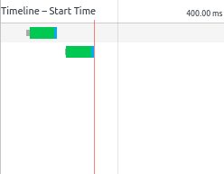
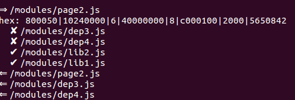

# Efficient module loading without bundling

### TL;DR

We can combine ES2015 modules, static analysis of those modules, HTTP/2, caching, Service Workers and a bloom-filter to create a server-client relationship where the client can efficiently load any module and its transitive dependencies without having to bundle the modules. You can see a demo [here](https://module-pusher.mariusgundersen.net) (works in Firefox and Chrome, you should open the dev tools) and you can find the source code of the demo on [GitHub](https://github.com/mariusGundersen/module-pusher).

### The problem

With ECMAScript 2015 JavaScript finally has a native module specification (lets ignore for the moment that no browser has yet implemented it (or that the module loader specification isn't done yet)). The syntax and semantics

So lets create a single page application for a browser that has ES6 module support. Today you would probably use Webpack, Browserify or Rollup to bundle these modules together into one file. The bundle is requested from the server only once, since it is cached on the clients machine so it's available right away the next time the user loads the application. The overhead in having a large file is only felt on the first visit, since the large file is not sent over the network on the next visit.

What would the SPA be like without bundling? On the first visit it will load very slowly, since it will have to load each module separately (on subsequent visits all of the modules will be cached, and it will load theoretically as quickly as the bundle). The application will have a root module that the page loads, and this root module will have dependencies, which themselves have dependencies, and this repeats until we reach the leaf modules, that have no dependencies. The SPA cannot start until all of the dependencies have been loaded, so the time it takes until the last module is received is the total time it takes to start the SPA. The module loader cannot know what transitive dependencies a root module has, and so it is forced to wait for the root module to load before it finds out what new modules to load, then it has to wait until those modules load, before it can find their dependencies. The result is that the modules will load one level at a time, and the deeper the dependency graph is, the slower the page will load.

The reason it takes a long time is not due to the size of the modules, but the round trip time to the server. Each request and response takes one RTT, and the total time it takes to load the application is the RTT multiplied with the number of levels in the dependency graph (assuming we can load as many modules in parallel as we want, which we can't, but lets not complicate it anymore than we have to). So to reduce the startup time of our SPA we need to reduce the number of round trips to the server.




Bundling solves this by sending all of the transitive dependencies together in one file when the root module is requested. This works out great if you have a single root node, which you do in a SPA, but if your application has multiple root nodes, then bundling can end up adding overhead.

An application has multiple root nodes if it has multiple views with some shared dependencies. A view can be an html page, a route in the SPA, or a pane in a tabbed layout. It's really in the eyes of the user what a view is. As programmers our goal is to load the application and it's current view as quickly as possible, and this can be achived by lazy loading the other views as they are needed. In a complex application the user may not see every view possible (they may be restricted by the permissions of their role for example), and so loading all of the modules in a single bundle would result in overhead for most users. How large this overhead is depends of course on the complexity of the application, and it might not be a problem for a simple application.

So instead of bundling all of the modules needed in the entire application, we need some way to bundle only the modules needed for the current view. But since each view has some unique modules and some shared modules, this becomes difficult. For an application with only two views, there are some that are only used in the first view (A), some that are only used in the second view (B), and some that are used in both. This can be represented by a Venn diagram.


We now have a few options for bundling this:

* We can bundle everything (the union of the two circles). This forces the user to wait for modules they don't need when they initally load the application, and an application with many views might end up loading views that are never shown to the user.
* We can bundle everything needed by the first view and everything needed by the second view. This results in only loading exactly what is needed for the inital view, but due to caching, users will end up loading modules that they already have when they go to the second page. In an application with many views and lots of shared modules this ends up with wasted data transferred for every view the user sees.
* We can bundle each view, and the shared modules (the intersection of the two circles). This is quite common, and is a balance between the previous two approaches. But as the number of views increases there will be some modules that are shared between most views and some that are only shared between a few views. The result is that some modules will be duplicated between two (or more) view bundles, and some modules will be loaded in the common bundle but only be required for a few views that the user might not see.

So we cannot reach the theoretically optimal loading using bundles, although we can get pretty close. The goal today is to reach that theoretical optimal loading.

### Server pushing of ES2015 modules

With HTTP/2 we get a new powerful feature called push. This lets the server send a file to the client before the client asks for it. For example, if the client requests the following js file, the server can decide to push `jquery.js` too, since it's likely that the client will request that file right afterwards.

```js
//getJson.js
import $ from 'jquery.js';

export default url => $.getJson(url);
```

The above file is written with ES2015 modules, which are designed to be statically analysable. This lets us find all the dependencies of a file (module) without running the code in the file. We can repeat the process for the dependencies, and this way we can build the full dependency graph for the entire application. Lets also assume that all the packages in npm (or bower or whatever package manager we use for this application) are also written as ES2015 modules, and we can now follow the dependency graph into any number of packages available on npm.

So now when the client requests any module the server can follow the dependency graph and find all of the transitive dependencies of that module, and push them to the client together with the requested module. This way, when the module loader on the client discovers that it needs a dependency, it will find that module in its cache, and we have bypassed the RTT to the server.


HTTP/2 is quite well supported in browsers and servers today, and it's easy to test this using the [http2 npm package](https://www.npmjs.com/package/http2).

So far so good, but now we have a problem with multiple views, since the server might end up pushing modules that the client has already cached. Any module that was a dependency of the previous views the client has seen has already been loaded and cached, and the server doesn't need to push those modules again. But there is no way for the server to know what modules the client has in its cache, and so the HTTP/2 server will end up waisting network resources by pushing files the client doesn't need or want.

### Bloom-filter

So the system currently looks like this: When the client sends an HTTP/2 request for any module the server will respond with that module and it will look at the dependency tree of that module, flatten it to a list of unique modules, and push those modules to the client. Unfortunately the client may have some of those modules already, and the server will end up pushing more data than the client actually requries. To prevent this, we need some way for the client to tell the server, in the request, what modules it already has.

The trivial solution would be to attach a list of all the modules the client already has (we will look into how the client knows what it has later) to the request as a header. But this would end up taking up a lot of data in each request, and isn't very efficient. We could hardcode a bitmap of modules, where each bit maps to each module, and indicates if the client has it (1) or not (0). But this bitmap would grow as the application grows, and it would make it difficult to continue development, as adding or removing modules could cause the client and server maps to get out of sync.

A more durable solution is to use a bloom-filter, which is a lookup structure that can probably tell you if it has an item, and guarantee that it is missing an item. In other words, if we ask a bloom-filter of modules if it contains a modules, it will either respond `certainly not` or `probably yes`. So it can not have false negatives, but it can have false positives, and the likelyhood of a false positive can be tuned.

So here is the plan: The client will creat the bloom-filter using all the modules it has, and it will send this bloom filter in the request header to the server. The server can now query the bloom-filter, and it will push each module that is `certainly not` cached by the client. There will be some false positives, where it mistakenly thinks the client has the module, and in these cases the client will have to request the module separately. This separate request/responds adds another RTT to the loading, which doubles the load time. As the number of modules cached by the client increases, the chance of a false positive increases, so we should tune the bloom-filter where this is unlikely for as long as possible, while at the same time the request header won't grow too big.

There are two parameters that can be used to tune the bloom-filter; the number of hashing functions `k` used (affects the cpu used) and the number of buckets `m` (affects the memory used). Varying these parameters will change the likelyhood of a false-positive as the number of items in the filter increases. Bloom filters are great for situations where the number of potential items that can be added to the filter is much larger than the number of items that will be added to the filter. For example, we could create a bloom-filter that has a 2% false positive likelyhood with 100 modules, and we could add any 100 modules from npm (which has about 260 000 packages, on average each consisting of several files/modules). If the goal is 2% false positive with 100 modules, then we will need about 800 bits and 6 hashing functions.

Note that this does not mean the maximum is 100 modules, just that there will be a higher chance of false positive after this point. There is probably a lot more math to be done here, based on the shape of the dependency grap (is it deep or shallow, does it have many common modules, etc) and the number of root nodes (pages). A depenency graph where the root nodes have a large number of common modules will likely need a smaller bloom-filter than what I got above. These calculations get difficult since ES6 modules support circular dependencies, and so we don't have a simple DAG anymore.

### Service Worker

Now we have a theoretical way for the client to let the server know which modules it has already cached, using bloom-filters. If the client can create a bloom-filter of about 100 bytes, and it can attach this to the request as a header, then the server can query the dependency tree and this bloom-filter and decide if it needs to push the depended modules or not. The only unsolved problem now is how the client can find out what it has cached. We can use a Service Worker for this.

A Service Worker is pretty much a proxy server written in JavaScript that runs on the client, through which every request to a domain must pass. LIke a proxy server it can intercept these requests, inspect them, and make decisions on how to respond to them. At its disposal it has access to a private cache, into which it can add request/response pairs and then later query the response to a request. This cache is not the same cache that browsers have had for decades, it's a new cache that the Service Worker has full and sole control over. The API of this cache lets us query it, list it's content and add/remove stuff from it.

So everytime the client application makes a request for a file from the server, the Service Worker will intercept it. If the request is for an ES2015 module, it will first look it up in the cache, and respond with the cached result if it exists. If it's missing, then it will have to forward the request to the server. But before it sends the request to the server, it will get a list of the modules in the cache, and create a bloom-filter of those modules. It can then add this serialized bloom-filter to the request as a header, and forward the request to the server. When the Service Worker receives the response from the server it will add it to the cache and respond to the client application. The client application has no idea what has happened, from its persective it requested a module and got the response.

Note that the pushed modules from the server will not be received by the Service Worker, as there is not (yet) any API for handeling pushed files. The only effect the push has is that the next time the client application requests a module that has been pushed, it will receive the response very quickly, as if the module was in the Service Worker cache.

The Service Worker specification has only been around for a few years, and it was only implemented in Chrome and Firefox about a year ago, so it's not well supported yet, and can be a it difficult to work with at times. For example, there is no good persistent key-value store yet, so I've had to build the bloom-filter for each requset, which isn't very efficent. Working with headers is also quite difficult, as I'm not allowed to query the request headers or append new headers to the request in the Service Worker. I'm not exactly why this is, but I suspect it's for some security reason that I'm not familar with.

You can see my [Service Worker source code on GitHub](https://github.com/mariusGundersen/module-pusher/blob/master/public/src/service-worker.js).

### Conclusion



With the trend towards many small packages and modules, towards react (or react-like) pure components, the number of modules in multi-view applications will increase. Manually bundling these modules in groups that prevent duplication while at the same time reducing the overhead of loading modules before they are needed, especially in an application that is under continous development by a large team of developers, becomes very difficult. With ECMAScript 2015 it's possible to run static analysis on modules and create a full dependency graph, and this dependency graph can be used at run time to more efficiently transfer the modules from the server to the client. I believe that this is a more scalable solution than bundling modules. It's possible to implement today, but it's not easy, mostly due to missing APIs in the Service Worker specification. I hope these APIs are added in the near future.