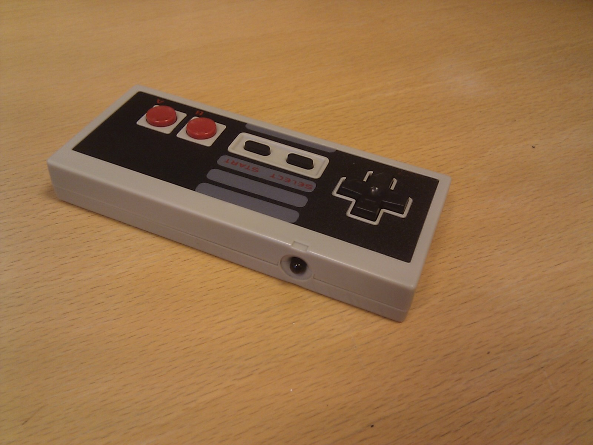
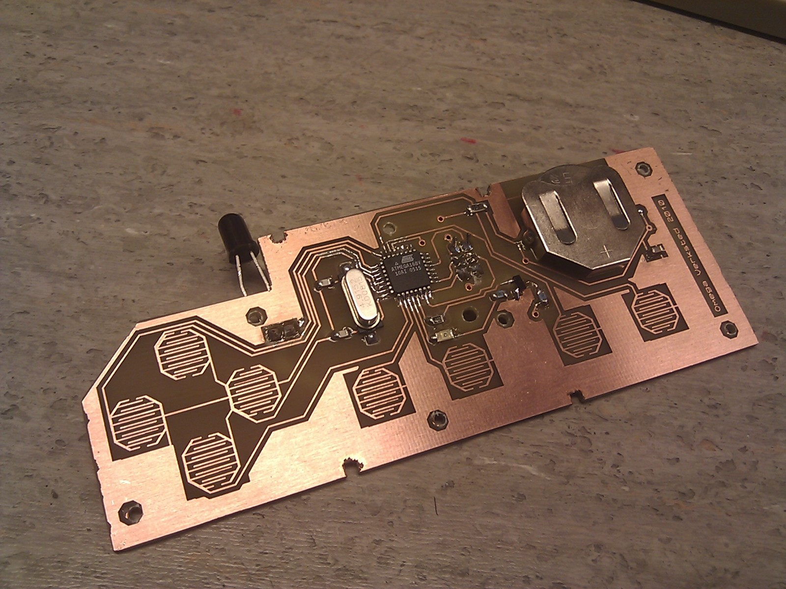

## NES Remote

A few weeks ago the remote to our TV went mysteriously missing, and since then we've had to change channels by getting out of our sofa. Obviously this is not the way TV should be enjoyed in the 21 century, so we needed a new remote. Instead of buying one I figured I could make one. At first I attempted to make one for my Android phone, by [connecting IR LEDs to the audio jack](http://www.lirc.org/html/audio.html), but so far that has failed to work. So over the weekend I decided to convert an old [NES controller](http://shop.ebay.com/i.html?_nkw=nes+controller) into a remote control.

Step one was to make a PCB that would fit inside the controller and have all the buttons (8), plastic pins (3) and screws (6) align properly. On this PCB I also needed to fit an [ATmega168](http://www.avrfreaks.net/index.php?module=Freaks%20Devices&func=displayDev&objectid=78) and a [button cell](http://en.wikipedia.org/wiki/Button_cell), along with some resistors and capacitors. After printing, exposing, developing and etching the board, it was soldered together and ready for programming.

Step two was programming the AVR. Since the remote would run of a single button cell battery, it needed to use as little power as possible. ATmegas have the ability to sleep, which will turn off everything, including the system clock, and will only wake up when one of the buttons is pressed. In Power Down mode, the remote used 1.5uA, which means it will (theoretically) still work a decade from now on a single battery. When a button is pressed, however, the LED drains quite a lot of power, so it wont last anywhere near that long with active use.

Once a button has been pressed, the remote needs to send an IR signal to the TV. Most IR remotes transmit a 38kHz square wave which is turned on or off to encode bits. We (used to) have a [Sony TV remote](http://lirc.sourceforge.net/remotes/sony/RM-836.jpg), which meant I had to replicate the [Sony IR protocol](http://users.telenet.be/davshomepage/sony.htm). This is a really simple signal to create, since all the pulses are multiples of 600uS. The next step was to find the code each button had to send to the TV, something the [LIRC project has available](http://lirc.sourceforge.net/remotes/sony/RM-836). With each of the buttons programmed to transmit a different code (up and down changes channel, left and right changes the volume, select is mute, start is power, A changes to channel 1 and B changes to a random channel), the remote was complete. I tested the remote with my [cell phone](http://www.ehow.com/how_5466798_use-tv-remote-isnt-dead.html) and compared the signal (using an oscilloscope) with the intended signal, before heading home and confirming that it works on the TV.
